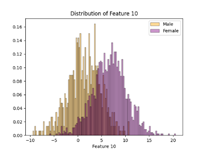
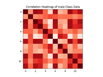

# Gender Identification

A machine learning binary classification task

Author: Shayan Taghinezhad Roudbaraki – 301425

Course: 01URTOV - Machine Learning and Pattern Recognition

Project
============
This project consists in gender identification from high-level features. The dataset consists of male and female speaker embeddings extracted from face images. A speaker embedding is a small-dimensional, fixed sized representation of an image. Features are continuous values that represent a point in the mdimensional embedding space. The embeddings have already been computed, you have to classify them.

Each sample consists of 12 continuous features. Classes are not balanced. To make the problem more tractable1, and to avoid potential privacy issues, the dataset consists of synthetic samples that behave similarly to real embeddings. The primary metric for the dataset is normalized actual DCF with (πT = 0:5; Cfn = 1; Cfp = 1). Expect costs in the order of 0:1 (error rate in the order of 10%) or less. Refer to the description of the project for more information.

Introduction
============

The dataset comprises image embeddings, which are reduced-dimensional representations of images achieved through mapping face images to a shared, lower-dimensional space using neural networks. To maintain the model's manageability, the dataset contains synthetic data with much lower-dimensional embeddings than what would be encountered in real-world scenarios. These embeddings are 12-dimensional vectors with continuous values and are categorized into either the male class or the female class. The individual components of the embeddings do not possess any physical interpretation.

Furthermore, within the training dataset, there are 1680 samples representing females and 720 samples representing males. In contrast, the evaluation dataset includes 1800 female samples and 4200 male samples.

Our main application will be a uniform prior and uniform cost for different misclassifications, with a working point defined by the triplet (πT=0.5, Cfn=1, Cfp=1). Without specifying the need for other application points in the project description, in this project no other application working point is selected for the project to be more manageable in regard to time and processing power. However, when training models, different priors are considered.

Features
========

Upon conducting an initial analysis of the training data, particularly by examining histogram plots, it is evident that the raw features exhibit a distribution that bears some resemblance to a Gaussian distribution. However, it is crucial to acknowledge that certain histograms do not display a purely Gaussian distribution. This observation raises doubts about the assumption of a strictly Gaussian distribution, as the data may be more accurately described by a combination of Gaussian distributions or other non-Gaussian models.

Furthermore, when examining scatter plots, compelling evidence emerges to support the existence of distinct patterns within the classes. These distinctive patterns indicate that the data within each class likely diverges from a purely Gaussian distribution and may possess more intricate structures. It is crucial to emphasize that even though marginal distributions are used for plotting, it does not guarantee that the point density of all dimensions follows to a Gaussian distribution.

Considering the way features are distributed in the scatter plots, it is expected that using models that are not strictly Gaussian or linear would be more effective for the task at hand.

By examining the histogram of the most discriminant direction obtained from LDA (Linear Discriminant Analysis), we can get useful information about how well linear classifiers might work. The analysis of the histogram indicates that a linear classifier has the ability to separate the classes reasonably well. However, it is important to note that there is still a chance of making errors in the classification process due to some overlap between the classes.

Displaying the magnitude of the Pearson correlation coefficient for each class (shown in the left image), separately for samples belonging to the female class (shown in the middle image) and samples belonging to the male class (shown in the right image).

After analyzing the correlation matrix, it is clear that few features are strongly correlated. This suggests that utilizing PCA (Principal Component Analysis) to transform the data into uncorrelated directions could be advantageous. However, it's important to consider that when the number of dimensions is reduced, PCA may unintentionally eliminate valuable information. Additionally, since PCA is a linear transformation, it may not be effective in all cases, so its usefulness needs to be assessed.

In addition, after examining the covariance matrix of each class, it is clear that they exhibit a significant degree of similarity. This discovery implies that using a linear classifier such as a tied Gaussian classifier has the potential to establish a robust separation rule, which aligns with our earlier discussion regarding the analysis of the main direction in LDA.

Furthermore, the presence of correlations between features within each class, as shown in the heatmap, indicates that the assumption of feature independence in Naive Bayes may lead to inaccurate predictions. Applying PCA in this scenario may be helpful.

Train protocol
==============

The effectiveness of each model is evaluated based on minimum costs, specifically using minDCF (minimum Detection Cost Function). To determine the most promising model and understand the impact of using PCA, a K-fold cross-validation approach with K=5 is implemented. Through K-fold cross-validation, the performance of various models can be assessed more efficiently, providing valuable insights into their effectiveness. This approach enables the evaluation of performance at a specific working point with different hyperparameters in a more efficient manner.

Gaussian classifiers
====================

In general, PCA does not seem to be effective. As predicted by analyzing the heatmap plot, the Naive Bayes model using raw features performs worse compared to other models that use all 6 raw features. However, when applying PCA, there is potential for improvement in this specific model as it transforms the data into a space where the directions are uncorrelated.

It is important to highlight that applying z-normalization did not lead to an improvement in the final results of the MVG models. As a result, we chose not to apply z-normalization in the other MVG models.

|     |     |     |     |
| --- | --- | --- | --- |
|     | Multivariate Gaussian | Naive | Tied |
| PCA | minDCF(pi=0.5) | minDCF(pi=0.5) | minDCF(pi=0.5) |
| -   | 0.11 | 0.444 | 0.105 |
| 12  | 0.11 | 0.117 | 0.105 |
| 11  | 0.112 | 0.125 | 0.108 |
| 10  | 0.159 | 0.164 | 0.157 |
| 9   | 0.185 | 0.188 | 0.176 |

Furthermore, based on the analysis of covariance matrices and the leading directions from LDA, it is clear that the tied model performs the best in the K-fold cross-validation procedure, with or without PCA, when compared to other models. Comparing the full covariance model with the tied model, it is evident that the linear decision surface yields better results than the quadratic one.

Logistic regression
===================

To begin with, we compare regularized logistic regression with another variant of logistic regression where we apply z-normalization to the data prior to training the model. Additionally, we assess class-balanced logistic regression while exploring various training priors. Furthermore, we conduct multiple iterations of PCA with different values to determine if it can enhance the results.

Log-Reg

|     |     |     |
| --- | --- | --- |
|     | Raw | Z-norm |
| Lambda | minDCF(π̃=0.5) | minDCF(π̃=0.5) |
| 1e-05 | 0.109 | 0.11 |
| 0.0001 | 0.109 | 0.11 |
| 0.001 | 0.109 | 0.107 |
| 0.01 | 0.107 | 0.132 |
| 0.1 | 0.107 | 0.209 |
| 1   | 0.129 | 0.376 |

Log-Reg with Lambda = 1e-4 for different priors

|     |     |
| --- | --- |
| πT  | minDCF(π̃=0.5) |
| 0.1 | 0.106 |
| 0.5 | 0.106 |
| 0.9 | 0.12 |

Trying different values for PCA

Log-Reg with Lambda = 1e-4, πT=0.5

|     |     |
| --- | --- |
| PCA | minDCF(π̃=0.5) |
| -   | 0.106 |
| 11  | 0.106 |
| 10  | 0.157 |
| 9   | 0.181 |

In general, the Multivariate Gaussian (MVG) model with tied covariances outperforms other models. Logistic regression, being a linear classifier, produces relatively similar results to the tied covariances model. The experiments with different values of πT show negligible improvements.

Based on the findings from generative models and the results obtained from linear logistic regression, it is clear that applying PCA does not provide significant advantages. Therefore, for the remaining analysis, we will solely consider the complete set of features without utilizing PCA.

Support Vector Machines
=======================

Upon comparing the performance of z-norm and raw support vector machines, it becomes apparent that the z-norm version exhibits small enhancements. This improvement suggests that applying z-normalization to the data prior to training the support vector machine model yields favorable outcomes.

|     |     |     |
| --- | --- | --- |
|     | Linear, Raw | Linear, Z-norm |
| C   | minDCF(π̃=0.5) | minDCF(π̃=0.5) |
| 1e-5 | 0.245 | 0.466 |
| 1e-4 | 0.128 | 0.465 |
| 1e-3 | 0.108 | 0.191 |
| 1e-2 | 0.118 | 0.125 |
| 1e-1 | 0.128 | 0.105 |
| 1   | 0.259 | 0.106 |
| 10  | 0.617 | 0.11 |
| 100 | 0.705 | 0.304 |

|     |     |
| --- | --- |
| Model | minDCF(π̃=0.5) |
| Tied Full Cov | 0.105 |
| LogReg (λ=1e-4, πT =0.5) | 0.106 |
| Linear SVM z-norm (c=0.1) | 0.105 |

Through a comparison of these linear models, it becomes evident that they demonstrate relatively similar results. However, it is worth noting that both the Tied Full Cov model and Linear SVM exhibit slightly better performance when compared to the LogReg model.

Let us now shift our focus towards non-linear kernels in our analysis. This involves comparing the performance of polynomial kernels with degrees 2 and 3, as well as the RBF (Radial Basis Function) kernel. Upon conducting this comparison, we observe that, overall, the z-norm polynomial kernel with degree 2 demonstrates strong performance compared to other polynomial models. Additionally, we find that the RBF kernel produces results that are similar to those achieved with the z-norm polynomial kernel. These insights emphasize the potential effectiveness of these non-linear kernels for the given task.

|     |     |
| --- | --- |
| Model | minDCF(π̃=0.5) |
| MVG | 0.11 |
| Poly (z-norm, d=2, c=0.1) | 0.121 |
| poly (z-norm, d=3, c=1e-5) | 0.483 |
| RBF (gamma=-5, c=100) | 0.135 |

After evaluating and comparing all the non-linear models, it can be concluded that the MVG (Multivariate Gaussian) model exhibits the best overall performance. This finding suggests that the MVG model is the most effective and accurate among the non-linear models considered in the analysis.

Gaussian Mixture Model
======================

Considering the Gaussian Mixture Models' ability to approximate diverse distribution types and taking into account our previous analysis of the data distribution, we expect to achieve better results compared to the Gaussian model. We will explore both the full covariance and tied models in our analysis to leverage the capabilities of Gaussian Mixture Models effectively.

After experimenting with z-normalization on our data, we have reached the conclusion that, in most cases, it does not provide significant benefits. As a result, we have made the decision to train our models using the raw features instead. This determination was made based on the observation that utilizing the raw features yielded comparable or better performance compared to using z-normalized data.

During the analysis of the Gaussian Mixture Model (GMM), we conducted experiments with varying numbers of components for each class within the full multivariate Gaussian.

|     |     |
| --- | --- |
| Number of components | minDCF(π̃=0.5) |
| 2   | 0.077 |
| 4   | 0.07 |
| 8   | 0.081 |

Subsequently, we identified the optimal number of components for each class and applied the same approach to other combinations of GMM models. This thorough investigation allowed us to determine the best number of components for each GMM model configuration, enhancing the accuracy and performance of the models.

|     |     |
| --- | --- |
| Model | minDCF(π̃=0.5) |
| Full tied | 0.07 |
| Naïve | 0.186 |
| Naïve tied | 0.186 |

Calibration
===========

Upon analyzing the Bayes error plot of our GMM classifier, it becomes evident that it demonstrates good performance across most application points. However, to further improve its effectiveness and account for potential errors in certain application points, it would be beneficial to implement score calibration.

For score calibration, we employ a weighted logistic regression approach. This method has been shown to yield better results, as it helps in better aligning the scores with the actual probabilities or likelihoods of correct classification. By applying score calibration, we can enhance the accuracy and reliability of the GMM classifier, especially in scenarios where errors might occur.

|     |     |     |     |
| --- | --- | --- | --- |
| Actual DCF | Π̃ = 0.5 | Π̃ = 0.1 | Π̃ = 0.9 |
| Calibrated | 0.082 | 0.235 | 0.210 |
| Uncalibrated | 0.078 | 0.252 | 0.213 |

|     |     |     |     |
| --- | --- | --- | --- |
| minDCF | Π̃ = 0.5 | Π̃ = 0.1 | Π̃ = 0.9 |
|     | 0.07 | 0.233 | 0.203 |

Upon examining the results below, it is evident that only the unbalanced application with 𝜋̃ = 0.9 exhibited a slight improvement. However, when comparing the performance of the uncalibrated scores to the calibrated ones, the difference is not significant. Therefore, for the sake of simplicity, we will retain the uncalibrated model as the final classifier for delivery purposes

Evaluation
==========

We begin by evaluating the Gaussian classifiers based on their minimum DCFs. This method allows us to determine if the proposed solution can truly achieve the highest level of accuracy.

The results obtained from the validation set confirm our earlier findings. It is clear that the MVG model with tied covariance, utilizing raw features, is the most appropriate choice for our primary application. The similarity in results suggests that the training and evaluation populations in this specific use case exhibit similar characteristics.

|     |     |
| --- | --- |
| Model | minDCF(pi=0.5) |
| MVG | 0.119 |
| Naïve | 0.434 |
| Full tied | 0.116 |

Moving forward, we proceed to analyze linear logistic regression. Once again, the obtained results align with our expectations. The results of evaluation set align with that of validation set. In addition, the linear models exhibit similar performance to the MVG linear classifier. As anticipated, setting the value of πT to 0.1 results in the optimal outcome in terms of minimum DCF.

|     |     |     |
| --- | --- | --- |
| C   | Raw, minDCF(π̃=0.5) | Z-norm, minDCF(π̃=0.5) |
| 1e-05 | 0.123 | 0.123 |
| 0.0001 | 0.123 | 0.122 |
| 0.001 | 0.1231 | 0.123 |
| 0.01 | 0.122 | 0.135 |
| 0.1 | 0.120 | 0.219 |
| 1   | 0.127 | 0.367 |

Now, we turn our focus to evaluating support vector machines (SVM). Once again, we observe strong performance in both SVM linear and SVM linear z-norm models, which are comparable and similar to the results obtained from the validation set and display a similar trend. This consistency highlights the effectiveness of these SVM models and reinforces their capability to generalize well beyond the training data.

|     |     |     |
| --- | --- | --- |
| C   | Linear, minDCF(π̃=0.5) | Linear (z-norm) , minDCF(π̃=0.5) |
| 1e-5 | 0.211 | 0.453 |
| 1e-4 | 0.118 | 0.443 |
| 1e-3 | 0.117 | 0.182 |
| 1e-2 | 0.122 | 0.119 |
| 1e-1 | 0.118 | 0.116 |
| 1   | 0.223 | 0.117 |
| 10  | 0.670 | 0.115 |
| 100 | 0.639 | 0.166 |

  
  

|     |     |     |     |
| --- | --- | --- | --- |
| C   | RBF, log γ = −3 | RBF, log γ = −4 | RBF, log γ = −5 |
| 1e-5 | 0.471 | 0.471 | 0.471 |
| 1e-4 | 0.471 | 0.471 | 0.471 |
| 1e-3 | 0.471 | 0.471 | 0.471 |
| 1e-2 | 0.436 | 0.471 | 0.471 |
| 1e-1 | 0.461 | 0.213 | 0.471 |
| 1   | 0.675 | 0.244 | 0.154 |
| 10  | 0.699 | 0.524 | 0.12 |
| 100 | 0.708 | 0.716 | 0.214 |

Continuing our evaluation, we find that the performance of the Gaussian Mixture Model (GMM) remains consistent and comparable to the results obtained from the validation set. This demonstrates the robustness of the GMM in generalizing well to new data.

Furthermore, when considering the test data, the GMM stands out as the best model choice for classification. It exhibits the lowest minimum DCF among all the other models that were evaluated using the test data. This reinforces the effectiveness of the GMM in accurately classifying unseen instances and solidifies its position as the preferred model for this task.

|     |     |
| --- | --- |
| Full untied | 0.061 |
| Full tied | 0.061 |
| Naïve untied | 0.178 |
| Naïve tied | 0.178 |